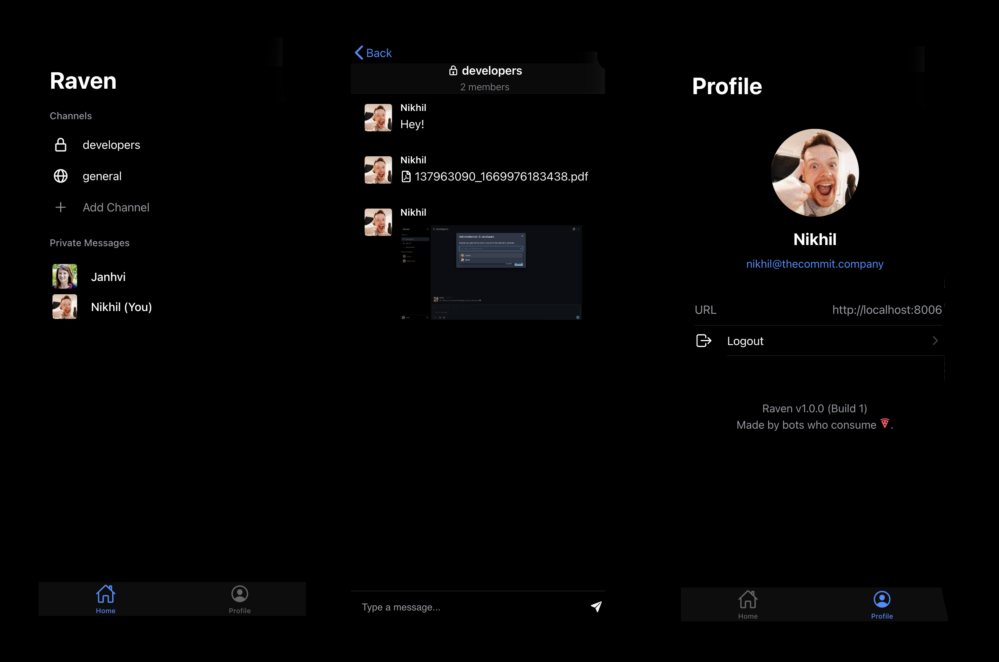

<p align="center">
  
  <p align="center">Simple, open source team messaging platform</p>
</p>
<p align="center">
  <a href="https://github.com/janhvipatil/Raven/blob/main/LICENSE">
    
  </a>
</p>

<br>

Raven is a simple work messaging tool that is built using [Frappe Framework](https://frappeframework.com) and can be installed on any new or existing Frappe site (e.g. in addition to ERPNext or [Gameplan](https://github.com/frappe/gameplan)). It is designed to help teams collaborate and communicate with each other and get work done. Teams can create their own channels (publically viewable or private) and send messages, emojis, files and images. 

<hr>

## Motivation

Raven was born out of a need to have a simple work communication tool that could replace Slack for us at The Commit Company. Most work communication tools in the market had the following problems:

1. They include many features like video calling, audio sharing on top of work messaging which are not required for small teams. However, these features are expensive to build and run. 
2. Hence, they require payments for every user every month - regardless of how much time a user uses the tool or how many messages they send. This meant that we would have to pay for "mostly inactive" users as well.
3. We were already using [ERPNext](https://erpnext.com) hosted on [Frappe Cloud](https://frappecloud.com) for our operations. Since all our users were already on ERPNext and we were paying for the server, we thought that a simple Frappe app can solve our work communication problem - and we feel there are many other teams and organizations who would benefit in a similar way.

<hr>

## Features

1. Send messages to all members in your organization (in an "open" channel), or just in your team in a private channel
2. Create new channels for your team and your team members
3. Send text messages 💬, code blocks 💻, emojis 😆, files 📑 and images 📸
4. Mention users in your messages with "@"
5. React to messages with emojis 🎉
6. Preview image/PDF files 📁
7. Comprehensive search 🔍 functionality for all your messages, files, channels and users
8. Don't strain your eyes 👀 - Raven supports dark mode 🌙
9. Collaborate on the go with the Raven mobile app 📱 (in progress)

<hr>

## Tech Stack

Raven is built using the [Frappe Framework](https://frappeframework.com) - an open-source full stack development framework. 

These are some of the tools it's built on:
- [Python](https://www.python.org)
- [Redis](https://redis.io/)
- [MariaDB](https://mariadb.org/)
- [Socket.io](https://socket.io/)

The frontend is built using React and the following tools:
1. [ChakraUI](https://chakra-ui.com) - UI components
2. [frappe-react-sdk](https://github.com/nikkothari22/frappe-react-sdk) - simple React hooks to interface with a Frappe framework backend - built and maintained by us at The Commit Company.
3. [react-icons](https://react-icons.github.io) - Icon set
4. [Framer Motion](https://www.framer.com/motion/) - Animations
5. [react-quill](https://www.npmjs.com/package/react-quill)

The mobile app is built using [Ionic](https://ionicframework.com), [Tailwind CSS](tailwindcss.com) and [Capacitor](https://capacitorjs.com).

<br>

<p align="center">
    <figure>
        
         <figcaption align="center">
            <b>Private channels in Raven</b>
        </figcaption>
    </figure>
</p>


<details>
  <summary>Show more screenshots</summary>


<figure>
        
         <figcaption align="center">
            <b>Channel details and members</b>
        </figcaption>
    </figure>

<figure>
        
         <figcaption align="center">
            <b>Adding members to a channel</b>
        </figcaption>
    </figure>

<figure>
        
         <figcaption align="center">
            <b>Emoji picker</b>
        </figcaption>
    </figure>

<figure>
        
         <figcaption align="center">
            <b>Light mode</b>
        </figcaption>
    </figure>

<figure>
        
         <figcaption align="center">
            <b>Preview Links</b>
        </figcaption>
</figure>
<figure>
        
         <figcaption align="center">
            <b>Send files and images</b>
        </figcaption>
    </figure>
  
<figure>
        
         <figcaption align="center">
            <b>Mobile app</b>
        </figcaption>
    </figure>
</details>

<br/>

#### Work in progress 🚧

The mobile app was set up using Capacitor, Ionic and React:
1. Set up authentication on the mobile app
2. View all channels, private messages and profile on mobile app
3. View a channel's messages (text, images and files) on the mobile app
4. Send a message on a channel.

New features were added to the web app:
1. Ability to create an "Open" channel - where all users are members by default.
2. Ability to delete a message previously sent
3. Ability to edit a message
4. Ability to send images and files by clicking on the file "plus" button
5. Ability to send images and files by dragging and dropping them into the chat interface
6. Image previews in the chat interface
7. Ability to download files from the chat interface
8. Styling improvements: dark mode for emoji picker, highlight for mentions in messages (@user), dark mode support for Quill mentions menu
9. General channel is created when app is installed.
10. Bug fix: empty messages cannot be sent
11. Bug fix: duplicate channel names cannot be created (added validation)
12. Bug fix: design issues fixed on the chat interface to make the chat messages responsive according to height of input.

<hr>

#### What's not working (yet)

Mobile app:
1. Channels cannot be created and channel details cannot be viewed
2. Members cannot be added to or removed from channels
3. Files and images cannot be sent.

Moreover, the mobile app authentication needs to be updated to use Bearer tokens because of a cookie issue on iOS. The mobile app works on Android.

Web app:
1. Improvements to be made on direct message listing.
2. Lazy loading and scroll to load for older messages.

<hr>


## Installation

Since Raven is a Frappe app, it can be installed via [frappe-bench](https://frappeframework.com/docs/v14/user/en/bench) on your local machine or on your production site.

Once you have [setup your bench](https://frappeframework.com/docs/v14/user/en/installation) and your [site](https://frappeframework.com/docs/v14/user/en/tutorial/install-and-setup-bench), you can install the app via the following commands:

```bash
bench get-app https://github.com/janhvipatil/Raven.git
bench --site yoursite.name install-app raven
```

Post this, you can access Raven on your Frappe site at the `/raven-app` endpoint (e.g. https://yoursite.com/raven-app). 

We plan to publish Raven to the [Frappe Cloud Marketplace](https://frappecloud.com/marketplace/apps) soon.

### Local development setup

To set up your local development environment, make sure that you have enabled [developer mode](https://frappeframework.com/how-to-enable-developer-mode-in-frappe) in your Frappe site config. 

You also need to disable CSRF (add `ignore_csrf: 1` in your `site_config.json`) since the React web server will not have any CSRF token in live reload mode. If you are working on the mobile app, you would also need to allow CORS (add `allow_cors: "*"` in your `site_config.json`). Please note that this is only for the local dev setup - not meant for Production. 

You can start the React live web server by:

```bash
cd frappe-bench/apps/raven
yarn dev
```

Your local dev server would be running at `http://localhost:8080`.

You can also run the mobile app on your browser by:

```bash
cd frappe-bench/apps/raven/mobile
yarn install
yarn dev
```

<hr>


## Future Plans

We are currently working or will be working on the following features. Please head to our Github issues page and feel free to contribute:

1. Mobile app for Raven
2. Open-graph link previews
3. Push notifications
4. Integration service - allowing other applications to create bots and send messages. Some popular services we are looking at are [Github](https://github.com), [Linear](https://linear.app), [Sentry][https://sentry.io], [Frappe Desk][https://frappedesk.com]. 

<hr>


## Reporting Bugs
If you find any bugs, feel free to report them here on [GitHub Issues](https://github.com/janhvipatil/Raven/issues). Make sure you share enough information (app screenshots, browser console screenshots, stack traces, etc) for project maintainers to replicate your bug.


<hr>


## License

AGPLv3

<hr>

## Maintainers

| Maintainer     | GitHub                                          | Social                                                       |
| -------------- | ----------------------------------------------- | ------------------------------------------------------------ |
| Janhvi Patil   | [janhvipatil](https://github.com/janhvipatil)   | [@janhvipatil\_](https://twitter.com/janhvipatil_)           |
| Aditya Patil   | [TITANiumRox](https://github.com/TITANiumRox) | |                                                              |
| Nikhil Kothari | [nikkothari22](https://github.com/nikkothari22) | [@nik_kothari22](https://twitter.com/nik_kothari22)          |
