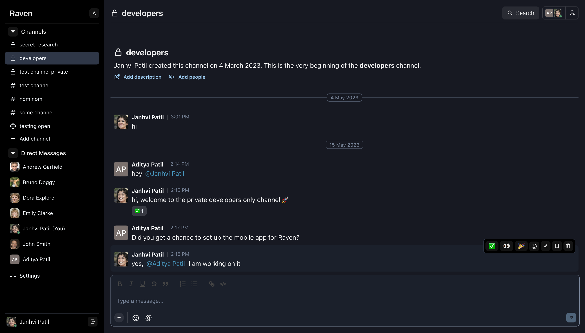
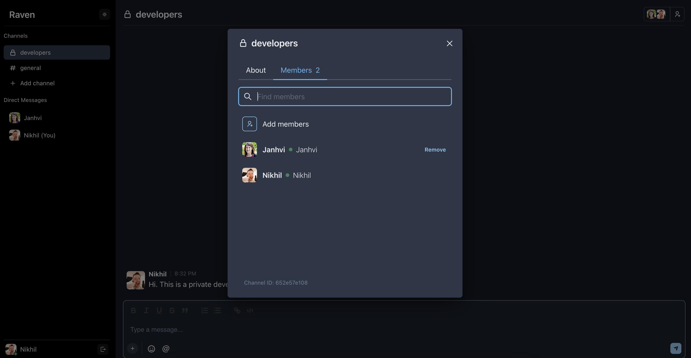
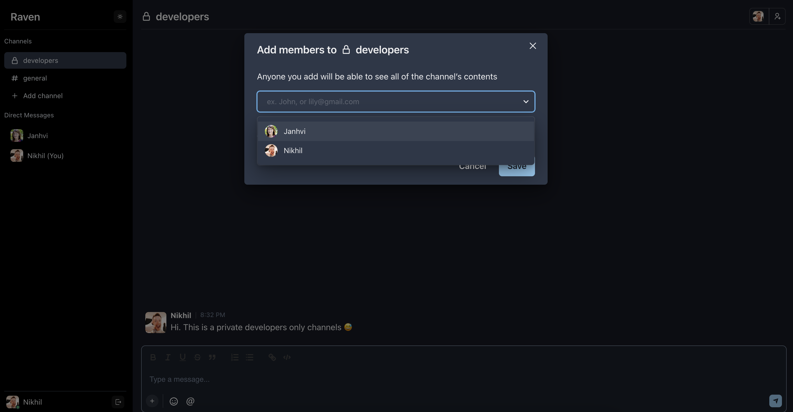
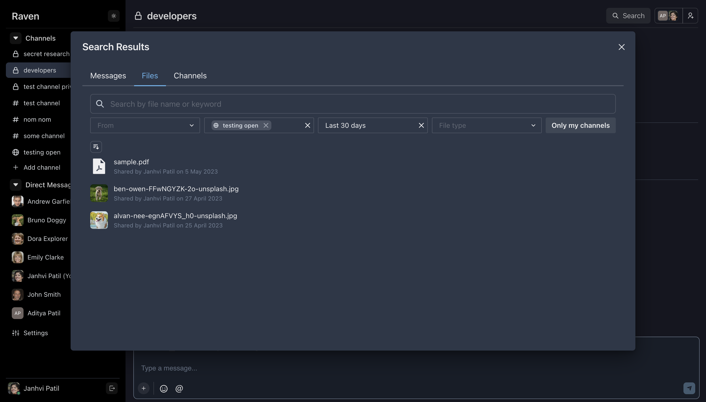
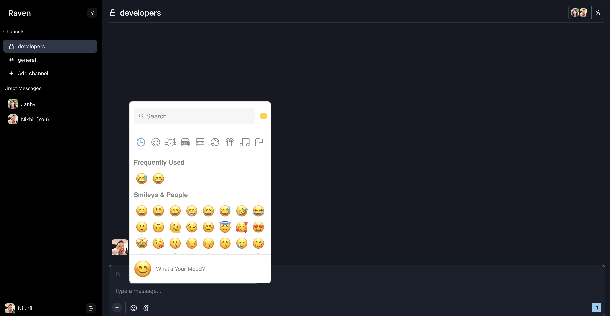
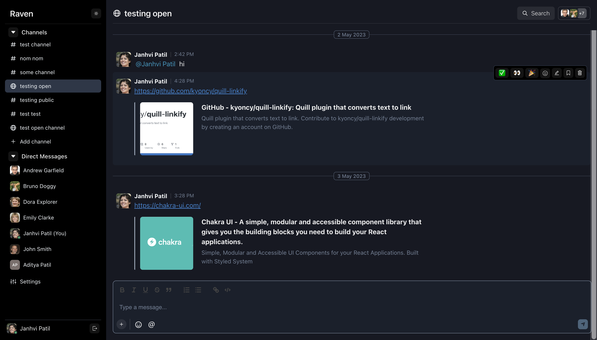
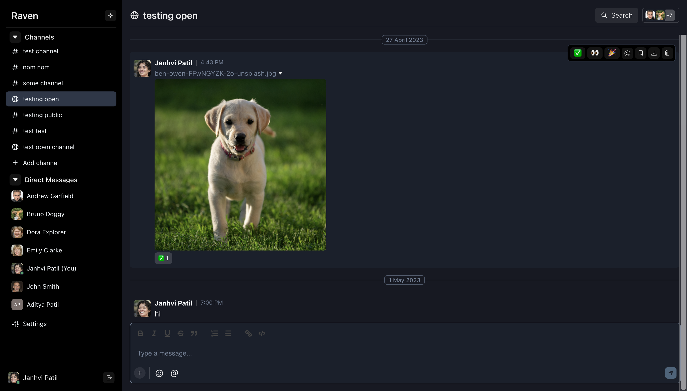
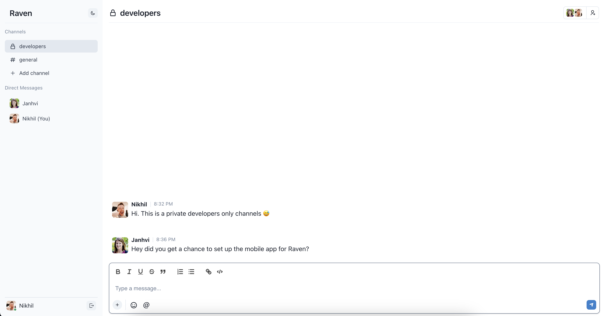

<p align="center">
  <a href="https://github.com/The-Commit-Company/Raven">
  
     </a>

   <h3 align="center">Raven</h3>
  <p align="center">Simple, open source team messaging platform
     <br />
    <br />
    <a href="https://frappecloud.com/marketplace/apps/raven"><strong>Install on Frappe Cloud»</strong></a>
    <br />
    <br />
    <a href="https://thecommit.company/products/raven"><strong>Learn More »</strong></a>
    <br />
    <br />
    <a href="https://github.com/The-Commit-Company/Raven/issues">Issues</a>
    ·
    <a href="https://community.ravenapp.cloud">Community</a>
     ·
    <a href="https://github.com/sponsors/The-Commit-Company?frequency=one-time">Sponsor Us!</a>
  </p>
</p>
<p align="center">
  <a href="https://github.com/The-Commit-Company/Raven/blob/main/LICENSE">
    
  </a>
     <a href="https://github.com/The-Commit-Company/Raven/stargazers"></a>
     <a href="https://github.com/The-Commit-Company/Raven/pulse"></a>
</p>

<br>

Raven is a simple work messaging tool that is built using [Frappe](https://frappeframework.com) and can be installed on any new or existing Frappe site (e.g. in addition to [ERPNext](https://erpnext.com/) or [FrappeHR](https://frappehr.com/)). It is designed to help teams collaborate and communicate with each other and get work done. Teams can create their own channels (publically viewable or private) and send messages, emojis, files and images. 

<hr>

## Motivation

Raven was born out of a need to have a simple work communication tool that could replace Slack for us at The Commit Company. Most work communication tools in the market had the following problems:

1. They include many features like video calling, audio sharing on top of work messaging which are not required for small teams. However, these features are expensive to build and run. 
2. Hence, they require payments for every user every month - regardless of how much time a user uses the tool or how many messages they send. This meant that we would have to pay for "mostly inactive" users as well.
3. We were already using [ERPNext](https://erpnext.com) hosted on [Frappe Cloud](https://frappecloud.com) for our operations. Since all our users were already on ERPNext and we were paying for the server, we thought that a simple Frappe app can solve our work communication problem - and we feel there are many other teams and organizations who would benefit in a similar way.

<hr>

## Features

1. Send messages to all members in your organization (in an "open" channel), or just in your team in a private channel
2. Create new channels for your team and your team members
3. Send text messages 💬, code blocks 💻, emojis 😆, files 📑 and images 📸
4. Mention users in your messages with "@"
5. React to messages with emojis 🎉
6. Preview image/PDF files 📁
7. Comprehensive search 🔍 functionality for all your messages, files, channels and users
8. Don't strain your eyes 👀 - Raven supports dark mode 🌙

<hr>

## Built with

Raven is built using the [Frappe Framework](https://frappeframework.com) - an open-source full stack development framework. 

These are some of the tools it's built on:
- [Python](https://www.python.org)
- [Redis](https://redis.io/)
- [MariaDB](https://mariadb.org/)
- [Socket.io](https://socket.io/)

The frontend is built using React and the following tools:
- [RadixUI](https://radix-ui.com)
- [frappe-react-sdk](https://github.com/nikkothari22/frappe-react-sdk) - simple React hooks to interface with a Frappe framework backend - built and maintained by us at The Commit Company.
- [react-icons](https://react-icons.github.io)
- [Tiptap](https://www.tiptap.dev)
- [Tailwind CSS](https://tailwindcss.com/)


<br>

<p align="center">
    <figure>
        
         <figcaption align="center">
            <b>Private channels in Raven</b>
        </figcaption>
    </figure>
</p>

<details>
  <summary>Show more screenshots</summary>
  

  <figure>
      
      <figcaption align="center"><b>Channel details and members</b></figcaption>
  </figure>
  
  <figure>
      
      <figcaption align="center"><b>Adding members to a channel</b></figcaption>
  </figure>
  
  <figure>
      
      <figcaption align="center"><b>Search</b></figcaption>
  </figure>
  
  <figure>
      
      <figcaption align="center"><b>Emoji picker</b></figcaption>
  </figure>
  
  <figure>
      
      <figcaption align="center"><b>Preview Links</b></figcaption>
  </figure>
  
  <figure>
      
      <figcaption align="center"><b>Send files and images</b></figcaption>
  </figure>
  
  <figure>
      
      <figcaption align="center"><b>Light mode</b></figcaption>
  </figure>
  
</details>


## Installation

Since Raven is a Frappe app, it can be installed via [frappe-bench](https://frappeframework.com/docs/v14/user/en/bench) on your local machine or on your production site.

Once you have [setup your bench](https://frappeframework.com/docs/v14/user/en/installation) and your [site](https://frappeframework.com/docs/v14/user/en/tutorial/install-and-setup-bench), you can install the app via the following commands:

```bash
bench get-app https://github.com/The-Commit-Company/raven.git
```

```bash
bench --site <yoursite.name> install-app raven
```

Post this, you can access Raven on your Frappe site at the `/raven` endpoint (e.g. https://yoursite.com/raven). 

### Local development setup

To set up your local development environment, make sure that you have enabled [developer mode](https://frappeframework.com/how-to-enable-developer-mode-in-frappe) in your Frappe site config. 

You also need to disable CSRF (add `ignore_csrf: 1` in your `site_config.json`) since the React web server will not have any CSRF token in live reload mode. Please note that this is only for the local dev setup - not meant for Production. 

You can start the React live web server by:

```bash
cd frappe-bench/apps/raven
yarn dev
```

Your local dev server would be running at `http://localhost:8080`.

<hr>

## Repo Activity


## Contributors

<a href="https://github.com/The-Commit-Company/Raven/graphs/contributors">
  
</a>


## Reporting Bugs
If you find any bugs, feel free to report them here on [GitHub Issues](https://github.com/The-Commit-Company/Raven/issues). Make sure you share enough information (app screenshots, browser console screenshots, stack traces, etc) for project maintainers to replicate your bug.


<hr>


## License

AGPLv3
