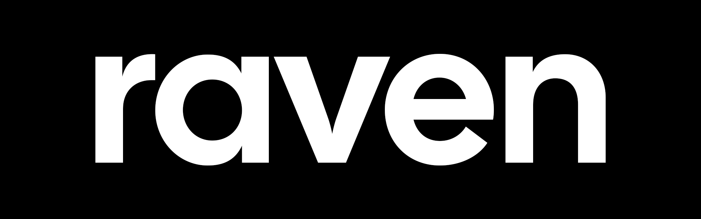
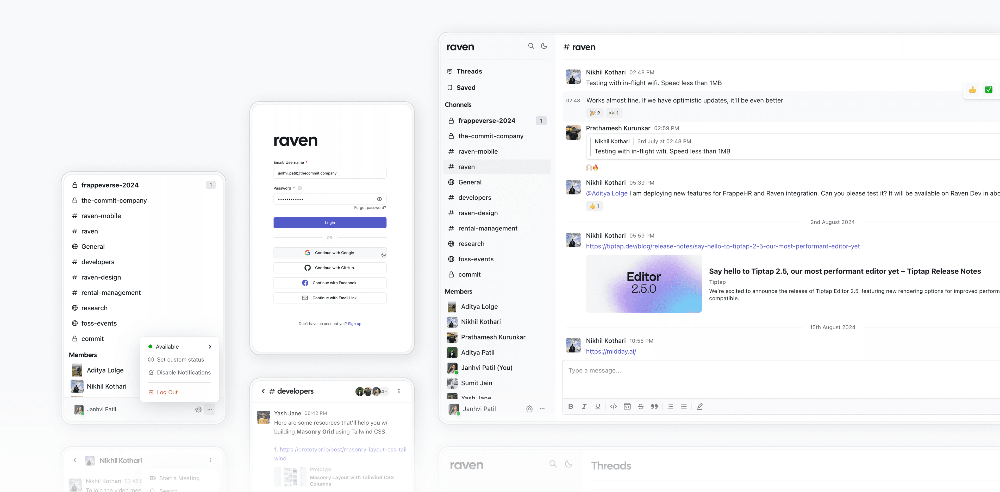

<p align="center">
  <a href="https://github.com/The-Commit-Company/raven">
  
     </a>
   <hr />
  <p align="center">Enterprise-first messaging platform that seamlessly integrates with your ERP
     <br />
    <br />
    <a href="https://frappecloud.com/dashboard/signup?product=raven"><strong>Install on Frappe Cloud</strong></a>
    <br />
    <a href="https://ravenchat.ai">Website (ravenchat.ai)</a>
    <br />
    <a href="https://github.com/The-Commit-Company/raven/issues">Issues</a>
    ·
    <a href="https://community.ravenapp.cloud">Community & Support</a>
     ·
    <a href="https://github.com/sponsors/The-Commit-Company?frequency=one-time">Sponsor Us!</a>
  </p>
</p>


<p align="center">
  <a href="https://github.com/The-Commit-Company/Raven/blob/main/LICENSE">
    
  </a>
     <a href="https://github.com/The-Commit-Company/raven/stargazers"></a>
     <a href="https://github.com/The-Commit-Company/raven/pulse"></a>
</p>

<p align="center">

</p>


​Raven is an open-source messaging platform that brings your team's conversations and information into one centralized place, enhancing collaboration and productivity. Whether you're at your desk or on the move, Raven keeps you connected on any device.​

It's built using [Frappe Framework](https://frappeframework.com) and offers deep integrations with other Frappe apps like [ERPNext](https://frappe.io/erpnext) and [FrappeHR](https://frappe.io/hr).

<hr>

## Key Features

1. **Organize conversations in channels:** Organize your conversations by topics, projects, or any category that suits your workflow. Send direct messages to other users or create channels for group discussions to keep everyone informed and engaged.​
2. **Craft your messages with rich text:** Easily send messages with formatting, highlights, links, emojis, code blocks, mentions and more
3. **Share images, documents, GIFs and more:** Need to share a file? Simply drag and drop it onto the screen. You can also find and share memes using our GIF search
4. **Reactions, Replies, and Threads:** Respond to messages with a reaction (custom emojis supported), inline replies or create threads for longer discussions.
5. **Integrate Seamlessly:**  Raven works effortlessly with other Frappe apps, allowing you to share documents from ERPNext with customizable previews, trigger notifications based on document events, perform workflow actions and, print documents directly within chats.​
6. **Agents, AI and more:** With Raven AI, automate tasks, extract data from files and images, and execute complex, multistep processes with just a message to an agent. Build your own agents without writing a single line of code to streamline your workflows.​
7. **Supports Dark Mode and Mobile**: Raven allows users to customize the app's appearance as well as offers a mobile app.
8. **Authentication and Security**: Supports all popular OAuth providers, custom OAuth providers, Login with email link, 2FA on Email/SMS/Auth App and LDAP.

<hr>

### Tech Stack

##### Common across web and mobile

- [Frappe Framework](https://frappeframework.com) - an open-source full stack development framework. It uses Python, MariaDB/Postgres, socket.io and Redis
- [React](https://react.dev)
- [Frappe React SDK](https://github.com/The-Commit-Company/frappe-react-sdk) - React Hooks library that we created/maintain to handle auth, data fetching and API calls to the Frappe Framework backend
- [Tailwind CSS](https://tailwindcss.com/) - 
- [Firebase](https://firebase.google.com) - Push notifications, Crash Analytics and Performance Monitoring

##### Web

- [RadixUI](https://www.radix-ui.com) - Accessible UI components for the web
- [TipTap](https://www.tiptap.dev) - Rich Text Editor
- [React Icons](https://react-icons.github.io/react-icons/) - icon library
- [emoji-mart](https://github.com/missive/emoji-mart) - Emoji Picker library

##### Mobile
- [React Native](https://reactnative.dev)
- [Expo](https://expo.dev) - for all plugins/utilities and deployment
- [NativeWind](https://www.nativewind.dev) - using TailwindCSS but on React Native
- [React Native Reanimated](https://docs.swmansion.com/react-native-reanimated/) - Animations for React Native
- [React Native Gesture Handler](https://docs.swmansion.com/react-native-gesture-handler) - to handle touch and gestures on React Native
- [Zeego](https://zeego.dev) - Dropdown menus for React Native


<br>

## Production setup

### Managed Hosting
You can try [Frappe Cloud](https://frappecloud.com), a simple, user-friendly and sophisticated [open-source](https://github.com/frappe/press) platform to host Frappe applications with peace of mind.

It takes care of installation, setup, upgrades, monitoring, maintenance and support of your Frappe deployments. It is a fully featured developer platform with an ability to manage and control multiple Frappe deployments.

<div>
	<a href="https://frappecloud.com/dashboard/signup?product=raven" target="_blank">
		<picture>
			<source media="(prefers-color-scheme: dark)" srcset="https://frappe.io/files/try-on-fc-white.png">
			
		</picture>
	</a>
</div>

### Self Hosting

Follow these steps to set up Raven in production:

**Step 1**: Download the easy install script

```bash
wget https://frappe.io/easy-install.py
```

**Step 2**: Run the deployment command

```bash
python3 ./easy-install.py deploy \
    --project=raven_prod_setup \
    --email=your_email.example.com \
    --image=ghcr.io/the-commit-company/raven \
    --version=stable \
    --app=raven \
    --sitename subdomain.domain.tld
```

Replace the following parameters with your values:
- `your_email.example.com`: Your email address
- `subdomain.domain.tld`: Your domain name where Raven will be hosted

The script will set up a production-ready instance of Raven with all the necessary configurations in about 5 minutes.


## Development Setup

### Docker

You need Docker, docker-compose and git setup on your machine. Refer [Docker documentation](https://docs.docker.com/). After that, follow below steps:

**Step 1**: Setup folder and download the required files

    mkdir raven
    cd raven

    # Download the docker-compose file
    wget -O docker-compose.yml https://raw.githubusercontent.com/The-Commit-Company/raven/develop/docker/docker-compose.yml

    # Download the setup script
    wget -O init.sh https://raw.githubusercontent.com/The-Commit-Company/raven/develop/docker/init.sh

**Step 2**: Run the container and daemonize it

    docker compose up -d

**Step 3**: The site [http://raven.localhost:8000/raven](http://raven.localhost:8000/raven) should now be available. The default credentials are:
- Username: Administrator
- Password: admin

### Local

To setup the repository locally follow the steps mentioned below:

1. Install bench and setup a `frappe-bench` directory by following the [Installation Steps](https://frappeframework.com/docs/user/en/installation)
2. Start the server by running 
```bash
bench start
```
3. In a separate terminal window, create a new site by running 
```bash
bench new-site raven.test
```
4. Map your site to localhost with the command 
```bash
bench --site raven.test add-to-hosts
```
5. Download the Raven app. Run 
```bash
bench get-app https://github.com/The-Commit-Company/raven
```
6. Install the app on the site 
```bash
bench --site raven.test install-app raven
```
7. Now open the URL `http://raven.test:8000/raven` in your browser, you should see the app running


###### Other Local Configurations

Make sure that you have enabled [developer mode](https://frappeframework.com/how-to-enable-developer-mode-in-frappe) in your Frappe site config. You can do so by running the following in your bench directory:

```bash
bench set-config -g developer_mode 1
```

You also need to disable CSRF (add `ignore_csrf: 1` in your `site_config.json`) since the React web server will not have any CSRF token in live reload mode. Please note that this is only for the local dev setup and is **not meant for Production**. 

```bash
bench --site raven.test set-config ignore_csrf 1
```


##### Web App

Raven's **web app** is a React based single page app located in the `/frontend` directory. It uses Vite to compile the app.
If you want to make changes to the frontend with hot reloading, follow the steps below:

1. Navigate to the apps/raven folder in your bench directory
```bash
cd apps/raven
```
2. Start the local web server
```bash
yarn run dev
```

This will start a local server at `http://localhost:8080` where the frontend app can be previewed in real time as you make changes. To make sure the setup works correctly, add a `.env.local` file in the `/frontend` directory with the following contents:

```
VITE_BASE_NAME='' # This needs to be set as empty
VITE_SOCKET_PORT=9000 # This is the port on which socket.io is running. It's usually the main Frappe server port (8000) but in the 9000 series
VITE_SITE_NAME='raven.test' # This is the same of the site
```


##### Mobile App

Raven's **mobile app** is a React Native based app built using Expo. It requires an [Expo Development Build](https://docs.expo.dev/develop/development-builds/introduction/) and will not run on Expo Go.

To get started, you need to install the [Expo CLI](https://docs.expo.dev/develop/tools/#expo-cli)

```bash
npm install -g eas-cli
```

You also need to have Xcode and/or Android Studio installed locally depending on your platform of choice.

The mobile app is located under the `apps/mobile` directory.
To start the development server and run it on a simulator, you can run 
```bash
yarn run ios
```

or 
```
yarn run android
```

This *should* start the emulators with the app running. For more info, please refer to the [Expo documentation](https://docs.expo.dev/get-started/introduction/)


## Forum and Support

- [Community Forum & Support](https://community.ravenapp.cloud)
- [YouTube](https://www.youtube.com/@TheCommitCompany)
<hr>

## Repo Activity


## Contributors

<a href="https://github.com/The-Commit-Company/raven/graphs/contributors">
  
</a>


## Reporting Bugs
If you find any bugs, feel free to report them here on [GitHub Issues](https://github.com/The-Commit-Company/raven/issues). Make sure you share enough information (app screenshots, browser console screenshots, stack traces, etc) for project maintainers to replicate your bug.


<hr>


## License

AGPLv3
